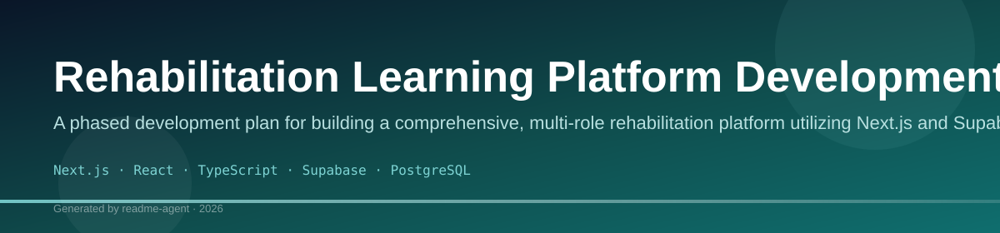

# सीखो और बढ़ो (REHAB Learning Platform)

An emotionally safe, Hindi-first interactive learning platform for rehabilitation centres serving underaged girls. Technology **augments** facilitators—it does not replace human interaction.

## Features (MVP)

- **Interactive learning modules** — micro-lessons (3–5 min) with quizzes and checkpoints
- **Branching story engine** — choice-driven narratives with emotional outcomes
- **Emotion check-ins** — pre/post module emoji-based tracking
- **Facilitator dashboard** — attendance, progress, emotion trends, printable reports
- **Volunteer guidance** — step-by-step facilitation scripts
- **Hindi-first UI** with English toggle
- **Calm ambient motion** — engagement without overstimulation
- **Web Speech API** — basic Hindi/English narration (browser TTS)
- **Local persistence** — Zustand + localStorage (works without backend)

## Quick Start

```bash
cd rehab-platform
npm install
npm run dev
```

Open [http://localhost:3000](http://localhost:3000). Choose a role:

| Role | Path |
|------|------|
| Student (छात्रा) | `/home` |
| Facilitator | `/dashboard` |
| Volunteer | `/guide` |

## Documentation

| Doc | Description |
|-----|-------------|
| [docs/ARCHITECTURE.md](docs/ARCHITECTURE.md) | System design, modules, API |
| [docs/DATABASE_SCHEMA.md](docs/DATABASE_SCHEMA.md) | Entity reference |
| [docs/MVP_ROADMAP.md](docs/MVP_ROADMAP.md) | Phases 1–4 |
| [docs/WIREFRAMES.md](docs/WIREFRAMES.md) | Screen layouts |
| [supabase/schema.sql](supabase/schema.sql) | PostgreSQL schema |

## Supabase Setup (Optional)

1. Create a project at [supabase.com](https://supabase.com)
2. Run `supabase/schema.sql` in the SQL editor
3. Copy `.env.example` → `.env.local` and add keys
4. Restart `npm run dev`

## Tech Stack

- **Next.js 16** (App Router)
- **React 19** + **TypeScript**
- **Tailwind CSS v4**
- **Framer Motion**
- **Zustand** (persisted state)
- **Supabase** (optional backend)

## Project Structure

```
src/
├── app/           # Routes (student, facilitator, volunteer, API)
├── components/    # UI, learning, story, emotion, dashboard
├── data/          # Seed modules, stories, guidance (MVP)
├── lib/           # i18n, supabase, utils
├── stores/        # Global app state
└── types/         # TypeScript definitions
```

## Design Principles

1. Emotional engagement before academic complexity
2. Interactivity over passive reading
3. Small learning loops (3–5 minutes)
4. Human-centered rehabilitation support
5. Warm, calm, child-safe aesthetics

## License

Private / NGO use — configure as needed for your organization.
# rehab

## Setup Guide

### Backend Setup

_From `README.md`:_


```bash
cd rehab-platform
npm install
npm run dev
```

Open [http://localhost:3000](http://localhost:3000). Choose a role:

| Role | Path |
|------|------|
| Student (छात्रा) | `/home` |
| Facilitator | `/dashboard` |
| Volunteer | `/guide` |


### Frontend Setup

```bash

npm install
npm run dev     # development
npm run build && npm start   # production
```

Open `http://127.0.0.1:3000` (or the port shown in the terminal).

### Running the Application

1. **Start web app** — `npm run dev` in `./`

```bash
cd .
npm install
npm run dev
```

## System Architecture

High-level system design, data flows, API map, and workflow pipelines derived from the repository structure.

### System Architecture

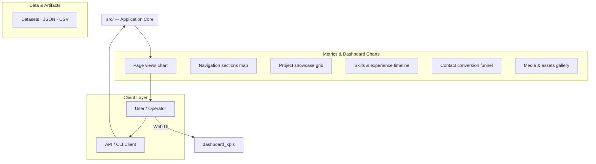

### Data Flow & Charts Pipeline

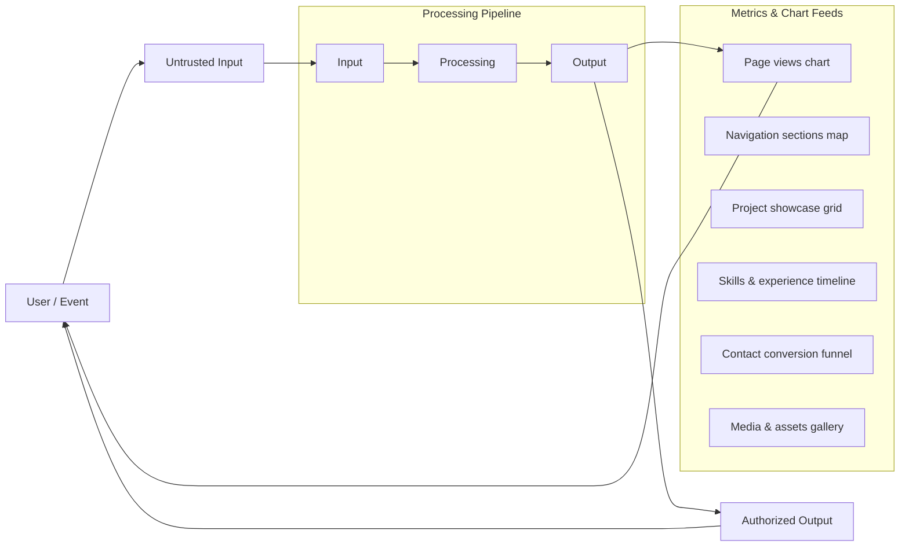

### Component & API Map

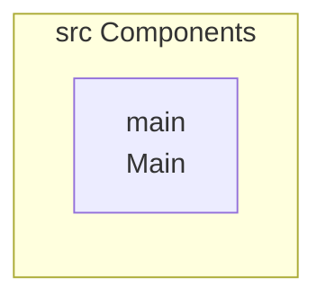

### Application Page Map

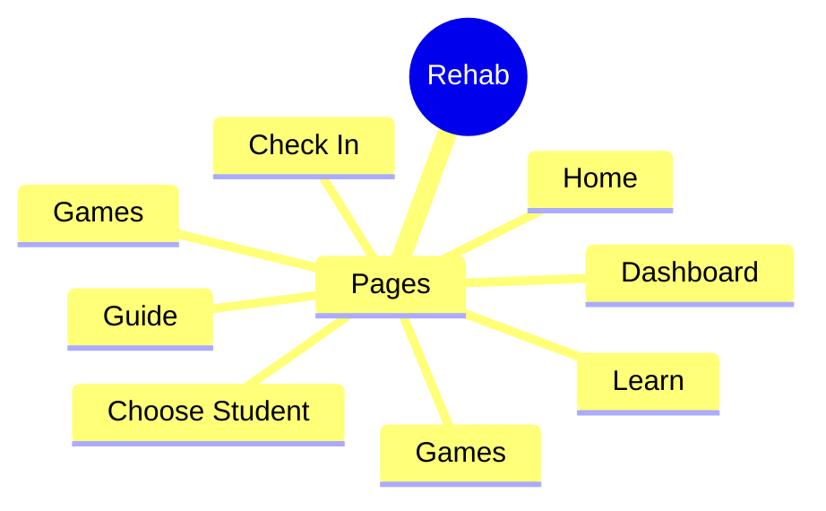

## Application Pages

Screenshots captured from the running application. Each page is listed with its function.

#### Home

Application page at `/`


#### Check In

Application page at `/check-in`

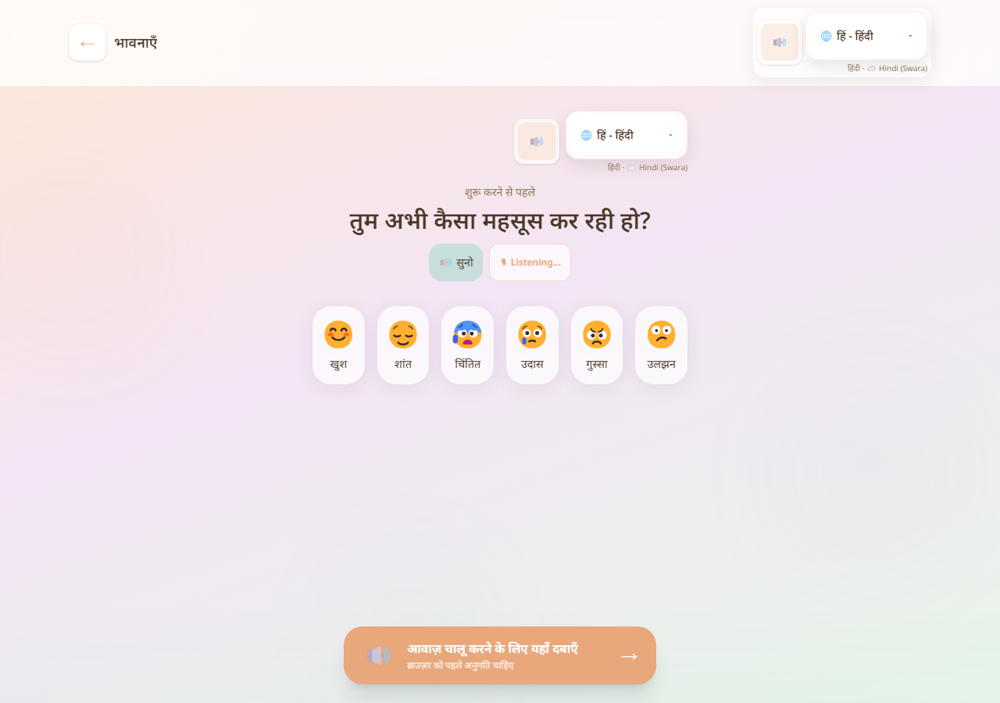

#### Choose Student

Application page at `/choose-student`

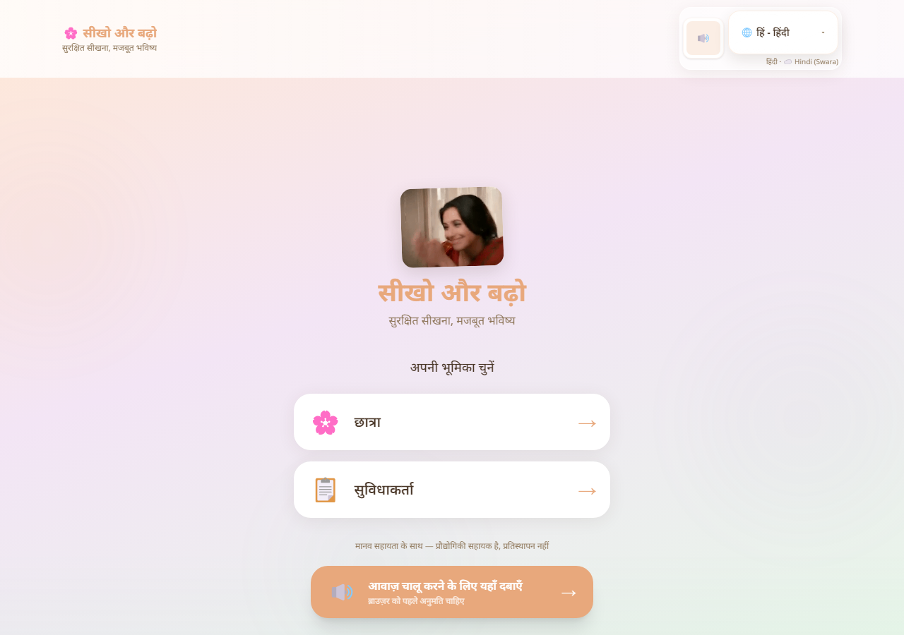

#### Dashboard

Application page at `/dashboard`


#### Games

Application page at `/games`

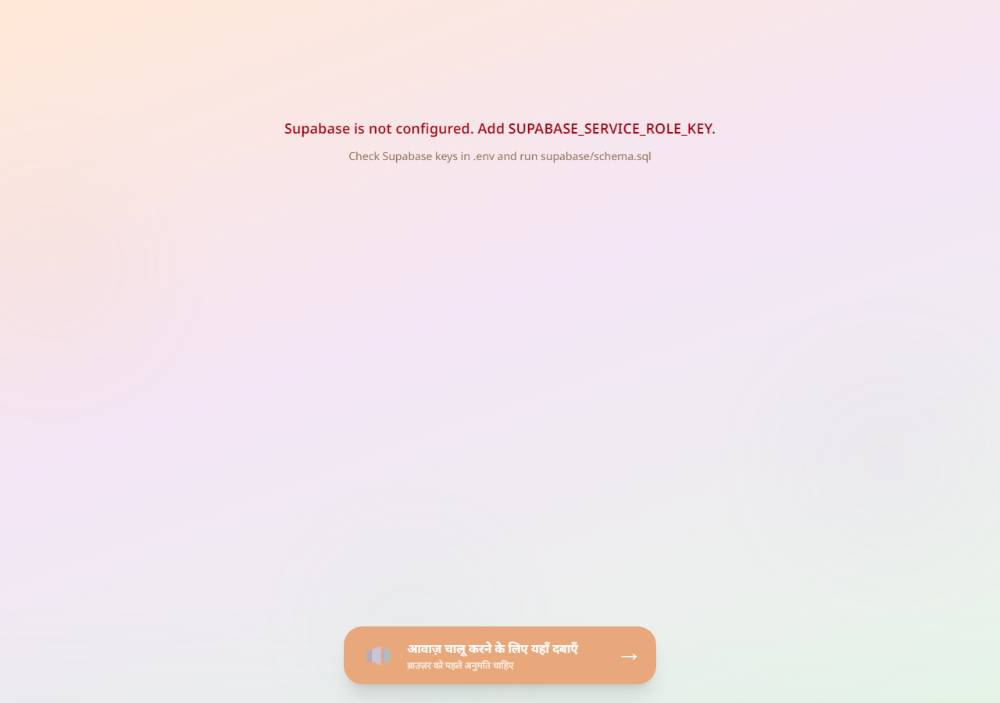

#### Guide

Application page at `/guide`

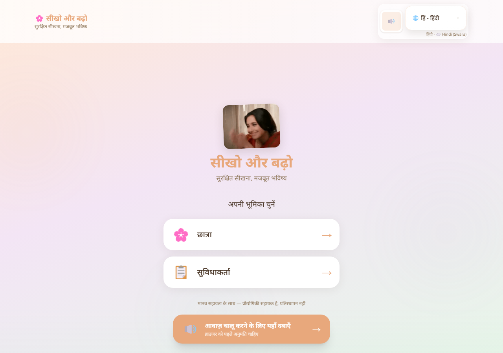

#### Home

Application page at `/home`

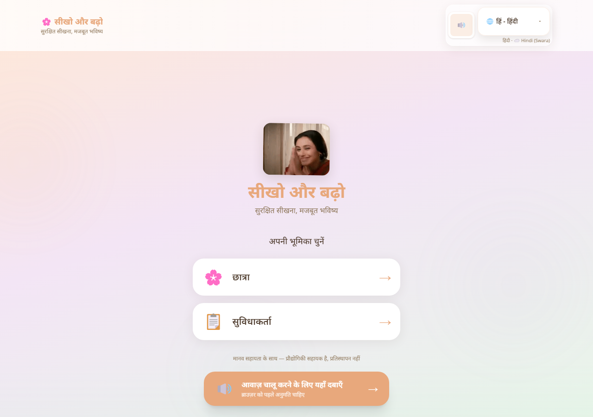

#### Learn

Application page at `/learn`

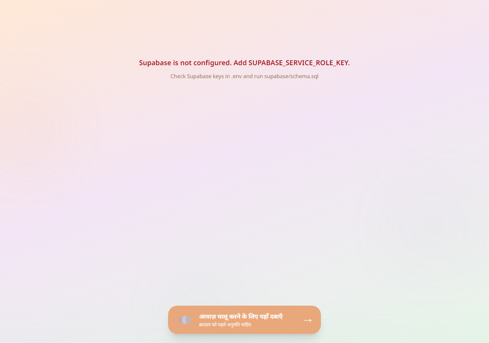

#### Story

Application page at `/story`


