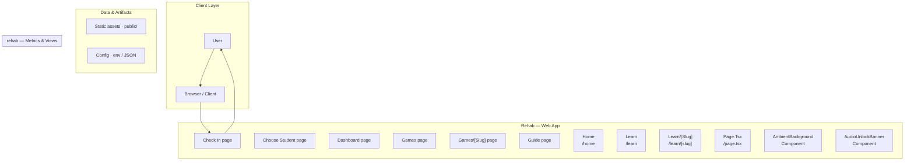
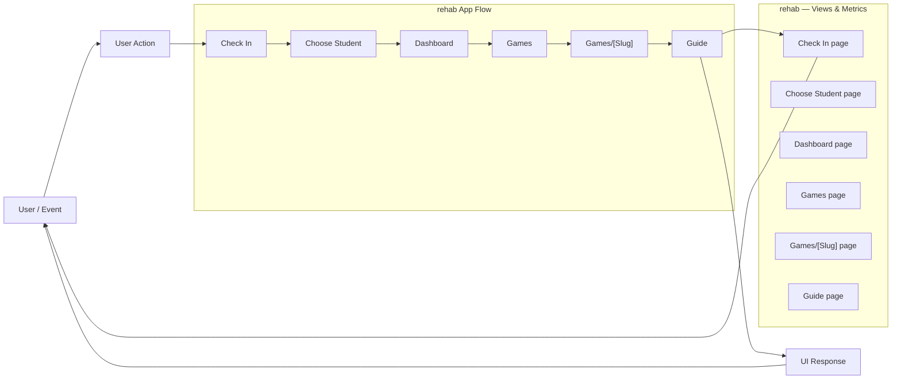
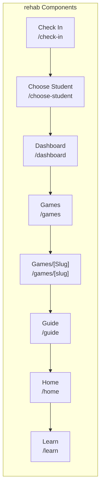
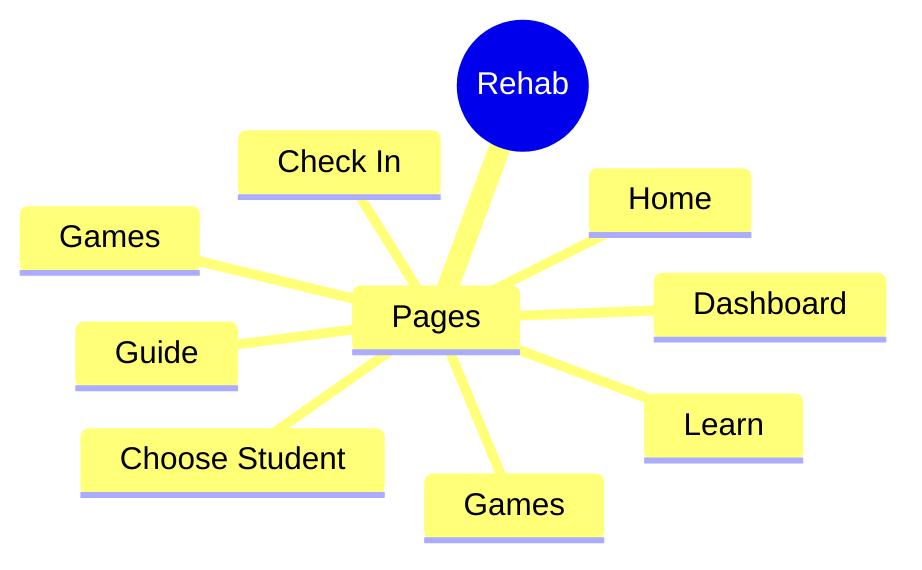

# Rehab Platform Development Roadmap

A phased development plan for building a multi-role mental health rehabilitation platform using Next.js and Supabase.

## Overview

This project is a comprehensive, multi-role web application designed to support mental health rehabilitation. It utilizes a modular architecture, separating concerns into distinct engines (Learning, Story, Emotion) and roles (Student, Facilitator, Volunteer). The core data persistence and authentication are managed by Supabase, which provides the backend services, database schema, and API layer. Development should proceed in structured phases, starting with foundational setup and moving toward complex feature integration and reporting.

## Problem

The platform aims to provide a structured, scalable, and engaging digital environment for mental health rehabilitation. It needs to manage diverse user roles, track longitudinal progress, and deliver targeted therapeutic content through various interactive modules.

## Solution

The solution is a Next.js application utilizing the App Router pattern, backed by a robust Supabase instance. The application is structured around role-based routing and modular components, ensuring that each feature (Learning, Story, Emotion) can be developed and scaled independently while sharing a common authentication and data layer.

## Key Features

- Role-Based Access Control (Student, Facilitator, Volunteer, Admin)
- Learning Engine: Structured educational content consumption.
- Story Engine: Interactive narrative modules for emotional processing.
- Emotion Tracking: Daily check-ins and mood logging.
- Attendance and Notes: Facilitators can track student attendance and add private notes.
- Guidance Sessions: Volunteers can lead structured guidance sessions.
- Analytics Dashboard: Comprehensive reporting on student progress, emotional trends, and module completion.
- Offline Support: Ability to cache and view content when internet connectivity is limited.

## Technology Stack

- Next.js
- React
- TypeScript
- Supabase
- PostgreSQL
- Tailwind CSS

# 🚀 Rehab Platform Documentation

Welcome to the Rehab Platform repository. This project is a comprehensive, full-stack application designed to provide a structured, emotionally engaging, and supportive environment for rehabilitation and skill development. It utilizes modern React and Next.js best practices, focusing heavily on state management and modular component design.

## 💡 Project Overview

**Goal:** To create a scalable, multi-role platform that facilitates structured learning loops, emotional check-ins, and community support for individuals undergoing rehabilitation or skill development.

**Design Principles:**
*   **User-Centric:** Focus on minimizing cognitive load and maximizing emotional engagement.
*   **Modular:** Components are highly reusable and separated by function.
*   **Scalable:** Built with Next.js 16 and TypeScript to handle complex state and future feature expansion.
*   **Data-Driven:** Utilizes Supabase for robust backend services, authentication, and data persistence.

## 🛠️ Getting Started

Follow these steps to get the local development environment running.

### Prerequisites
*   Node.js (LTS recommended)
*   npm or yarn

### 1. Clone the Repository
```bash
git clone [repository-url]
cd rehab-platform
```

### 2. Install Dependencies
```bash
npm install
```

### 3. Configure Environment Variables
Create a `.env.local` file in the root directory and populate it with your necessary credentials (e.g., Supabase keys, API keys).

### 4. Run the Application
```bash
npm run dev
```

The application should now be accessible at `http://localhost:3000`.

## 🏗️ Architecture & Tech Stack

### Technology Stack
*   **Frontend:** Next.js 16, React 19, TypeScript, Tailwind CSS v4
*   **State Management:** Zustand (for global, predictable state)
*   **Backend/Database:** Supabase (Authentication, Database, Storage)

### Core Architecture Components
*   **`app/`:** Contains the main routing structure and page components.
*   **`components/`:** Houses all reusable UI elements (e.g., `Card`, `Button`, `ProgressTracker`).
*   **`stores/`:** Dedicated directory for Zustand store definitions, managing global application state (e.g., `useAuthStore`, `useProgressStore`).
*   **Data Flow:** The application follows a unidirectional data flow: **Supabase** $\rightarrow$ **Zustand Store** $\rightarrow$ **Components** $\rightarrow$ **UI**. This ensures state changes are predictable and traceable.

## 👤 User Roles and Navigation

The platform supports three primary roles, each with distinct access levels and dedicated sections:

| Role | Primary Focus | Key Features | Entry Point | 
| :--- | :--- | :--- | :--- | 
| **Student** | Personal Progress & Learning | Daily check-ins, Module completion, Progress tracking, Resource access. | `/dashboard` | 
| **Facilitator** | Oversight & Management | Group monitoring, Content creation, User assignment, Intervention logging. | `/admin/facilitator` | 
| **Volunteer** | Support & Engagement | Resource moderation, Community interaction, Direct support logging. | `/volunteer/dashboard` | 

## 🗺️ Key Modules and Features

### 1. Progress Tracking & Modules
*   **Functionality:** Tracks user progress through defined rehabilitation modules.
*   **Implementation:** Utilizes `ProgressTracker` components and `useProgressStore` for state management.
*   **Key Screens:** Module Dashboard, Daily Check-in Form.

### 2. Authentication & Profile
*   **Functionality:** Secure login/logout, role-based access control (RBAC).
*   **Implementation:** Handled by Supabase Auth and `useAuthStore`.
*   **Key Screens:** Login Page, User Profile Settings.

### 3. Content Management (Admin/Facilitator)
*   **Functionality:** Allows facilitators to create, edit, and assign educational content and modules.
*   **Implementation:** Requires specific API endpoints and Supabase write permissions.
*   **Key Screens:** Module Creation Form, Resource Library.

## 🚀 Development Roadmap & Next Steps

This repository is highly structured, making feature addition straightforward. Recommended next steps include:

1.  **Implement Role-Based Guarding:** Ensure all routes are strictly protected by the `useAuthStore` to prevent unauthorized access.
2.  **Advanced State Validation:** Add comprehensive validation layers to all forms (especially in the `Student` and `Facilitator` modules) before submitting data to Supabase.
3.  **Testing Suite:** Develop unit and integration tests for the core state logic in the `stores/` directory to ensure stability as the platform grows.

## Setup Guide

### Backend Setup

_From `README.md`:_


```bash
cd rehab-platform
npm install
npm run dev
```

Open [http://localhost:3000](http://localhost:3000). Choose a role:

| Role | Path |
|------|------|
| Student (छात्रा) | `/home` |
| Facilitator | `/dashboard` |
| Volunteer | `/guide` |


### Frontend Setup

```bash

npm install
npm run dev     # development
npm run build && npm start   # production
```

Open `http://127.0.0.1:3000` (or the port shown in the terminal).

### Running the Application

1. **Start web app** — `npm run dev` in `./`

```bash
cd .
npm install
npm run dev
```

## System Architecture

High-level system design, data flows, API map, and workflow pipelines derived from the repository structure.

### System Architecture



### Data Flow & Charts Pipeline



### Component & API Map



### Application Page Map



## Application Pages

Screenshots captured from the running application. Each page is listed with its function.

#### Home

Application page at `/`


#### Check In

Application page at `/check-in`


#### Choose Student

Application page at `/choose-student`


#### Dashboard

Application page at `/dashboard`


#### Games

Application page at `/games`


#### Guide

Application page at `/guide`


#### Learn

Application page at `/learn`


#### Story

Application page at `/story`


